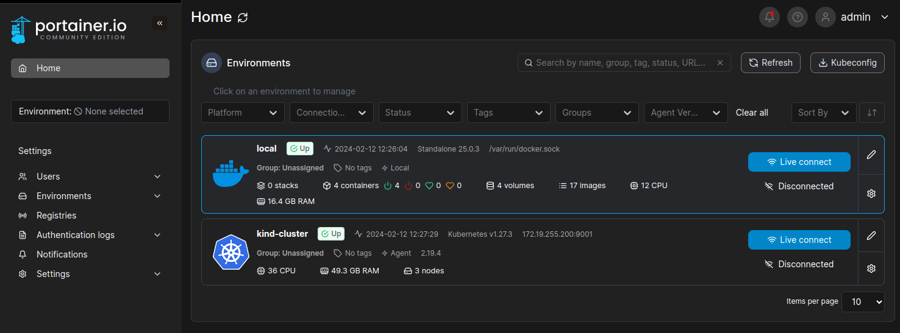

# Examples developed

<!-- TABLE OF CONTENTS -->
<details>
  <summary>Table of Contents</summary>
  <ol>
    <li><a href="#ds-fully-local">Data Space Fully Local</a>
    </li>
    <li>
        <a href="#kind-cluster">Kind Cluster</a>
        <ul>
            <li><a href="#cheatsheet">Cheatsheet</a></li>
      </ul>
    </li>
    <li><a href="#minimal-ds">Minimal DS</a></li>
  </ol>
</details>

## Data Space Fully Local

Deployment of the Fiware [Demo Setup DSBA-compliant Data Space](https://github.com/FIWARE-Ops/fiware-gitops/tree/master/aws/dsba) in a local environment.

**Source:** [ds_fully_local](ds_fully_local/)

## Kind Cluster

**Source:** [kind_cluster](kind_cluster/)

### Cheatsheet

#### Portainer

Portainer is a lightweight management UI which allows you to easily manage your different Docker environments (Docker hosts or Swarm clusters).

```
https://localhost:9443
```

Add a pass, for example: `LSvJz#5Q$hw!sY`

Using kubectl get the ip for the portainer service:

```bash
kubectl get services -n portainer
```



## Minimal Data Space

Minimal Data Space deployment.

**Source:** [minimal_ds](minimal_ds/)


### Cheetsheet

- Get the pods status:
```bash
watch kubectl get pods --context kind-minimal-dataspace-cluster --kubeconfig ~/.kube/config_minimalDS --all-namespaces
```

```bash
watch kubectl get pods --context kind-minimal-dataspace-cluster --kubeconfig ~/.kube/config_minimalDS -n ds-connector-a
```

- Get all certificates:
```bash
  kubectl get cert --context kind-minimal-dataspace-cluster --kubeconfig ~/.kube/config_minimalDS --all-namespaces
```